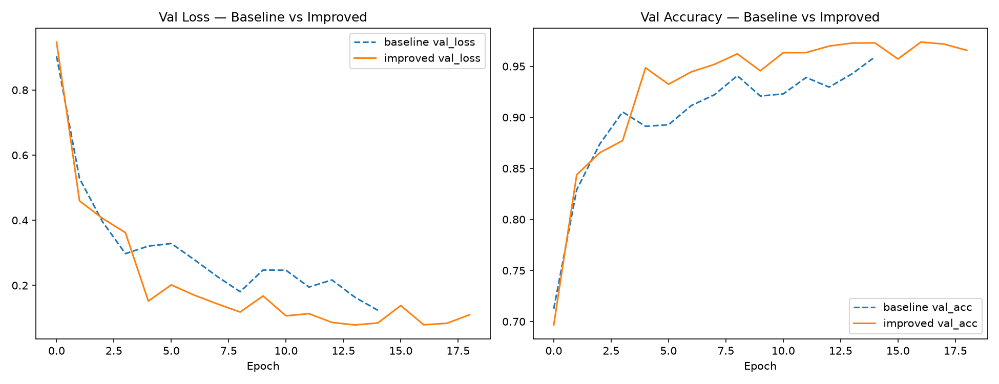
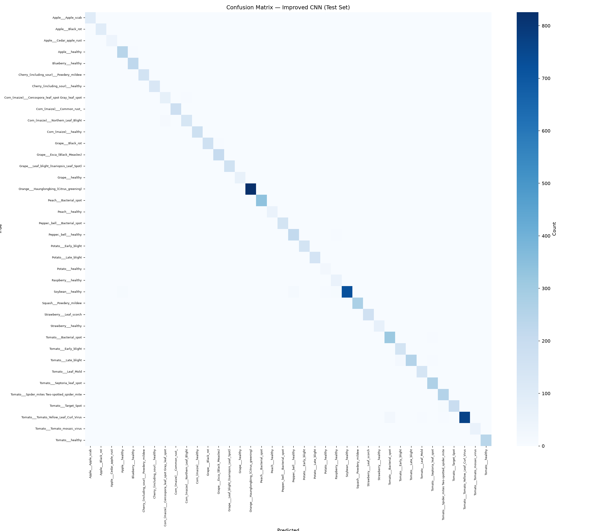

# 🌿 The Herbarium — Plant Disease Classification (PlantVillage)

An end-to-end CNN image classification project built on the **PlantVillage (color)** dataset — identifying plant species and disease status from leaf photographs, from raw data through a deployed diagnostic app.

Built from scratch in PyTorch, with a documented, reasoned progression through EDA, baseline modeling, architecture improvement, evaluation, explainability, and error analysis — deliberately including the decisions made *not* to do something (e.g. skipping exhaustive hyperparameter tuning) and why.

---

## 🚀 Live Demo

**[Try it on Streamlit Cloud → ](#)** *(link to be added after deployment)*

---

## Table of Contents

- [Overview](#overview)
- [Dataset](#dataset)
- [Project Structure](#project-structure)
- [Setup](#setup)
- [How to Run This](#how-to-run-this)
- [Pipeline & Results](#pipeline--results)
  - [Phase 1 — EDA](#phase-1--eda)
  - [Phase 2 — Data Processing](#phase-2--data-processing)
  - [Phase 3 — Baseline CNN](#phase-3--baseline-cnn)
  - [Phase 4 — Improved CNN](#phase-4--improved-cnn)
  - [Phase 5 — Tuning](#phase-5--tuning-skipped)
  - [Phase 6 — Evaluation](#phase-6--evaluation)
  - [Phase 7 — Explainability](#phase-7--explainability-grad-cam)
  - [Phase 8 — Error Analysis](#phase-8--error-analysis)
  - [Phase 9 — Deployment](#phase-9--deployment)
- [Key Design Decisions](#key-design-decisions)
- [Limitations](#limitations)
- [Tech Stack](#tech-stack)
- [Acknowledgments](#acknowledgments)

---

## Overview

| | |
|---|---|
| **Task** | Multi-class image classification (38 classes) |
| **Dataset** | PlantVillage — color subset |
| **Framework** | PyTorch |
| **Final model** | Custom CNN, 5 conv blocks + BatchNorm + GlobalAveragePooling |
| **Test accuracy** | **97.63%** |
| **Macro F1** | **97.20%** |
| **Deployment** | Streamlit app — "The Herbarium" |


---

## Dataset

**PlantVillage (color)** — 38 classes spanning 14 crop species (Apple, Blueberry, Cherry, Corn, Grape, Orange, Peach, Bell Pepper, Potato, Raspberry, Soybean, Squash, Strawberry, Tomato), each labeled as either healthy or a specific disease.

- **~54,300 images total**, lab-photographed against plain, controlled backgrounds
- **Significant class imbalance**: largest class (`Orange___Haunglongbing_(Citrus_greening)`, ~5,500 images) to smallest (`Potato___healthy`, ~150 images) — roughly a **36:1 ratio**
- **Duplicate check**: 0 duplicates found in a 5,000-image sample (~9% of the dataset) — no train/test leakage detected

Dataset is not included in this repository due to size — download the PlantVillage color dataset and place it at:
```
data/raw/plantvillage dataset/<class_name>/*.jpg
```

---

## Project Structure

```
Project CNN/
├── data/
│   ├── raw/plantvillage dataset/   # original dataset (not committed — see Setup)
│   └── metadata/                   # generated: splits, class mapping, predictions
├── notebooks/
│   ├── 01_eda.ipynb
│   ├── 02_baseline_cnn.ipynb
│   ├── 03_improved_cnn.ipynb
│   ├── 05_evaluation.ipynb
│   ├── 06_explainability.ipynb
│   └── 07_error_analysis.ipynb
├── src/
│   ├── config.py              # single source of truth — paths, hyperparameters
│   ├── data_split.py          # stratified 70/15/15 split, class mapping
│   ├── data_loader.py         # Dataset + weighted-sampler DataLoader
│   ├── augmentations.py       # train/eval transform pipelines
│   ├── models/
│   │   ├── baseline_cnn.py
│   │   └── improved_cnn.py
│   ├── train.py                # reusable training loop (both models)
│   ├── evaluate.py             # test-set evaluation, confusion matrix, F1
│   ├── gradcam.py              # Grad-CAM explainability
│   └── predict.py              # single-image inference
├── app/
│   ├── streamlit_app.py        # "The Herbarium" — deployed diagnostic app
│   └── requirements.txt
├── models/                     # generated: trained checkpoints
├── outputs/                    # generated: plots, logs, Grad-CAM, misclassified samples
└── requirements.txt
```

---

## Setup

```bash
git clone <this-repo>
cd "Project CNN"
pip install -r requirements.txt
```

Download the PlantVillage (color) dataset and place it at `data/raw/plantvillage dataset/`, preserving the per-class folder structure.

---

## How to Run This

Run everything from the project root, in this exact order. A few steps offer **two equivalent options** (a `.py` script or a notebook) — **run only one of each pair**, never both; they call the same underlying code and running both just repeats identical work for no benefit.

| # | Step | Command / File | Notes |
|---|---|---|---|
| 1 | Install dependencies | `pip install -r requirements.txt` | One-time |
| 2 | Build train/val/test split | `python src/data_split.py` | Generates `data/metadata/train_labels.csv`, `class_mapping.json`, `class_distribution.csv`. **Everything below depends on this.** |
| 3 | *(Optional)* Sanity-check the data loader | `python src/data_loader.py` | Confirms batch shapes and that the weighted sampler is balancing classes correctly. Safe to skip once confirmed working. |
| 4 | Run EDA | `notebooks/01_eda.ipynb` | Notebook only — no `.py` equivalent. |
| 5 | Train baseline CNN | **Either** `python src/train.py` **or** `notebooks/02_baseline_cnn.ipynb` — pick one | Both call the same `run_training()`. The notebook additionally shows inline curves and a quick test-set check; the script is faster if you don't need that. |
| 6 | Train improved CNN | `notebooks/03_improved_cnn.ipynb` | Notebook only — trains the model **and** plots it directly against the baseline's saved history, so it needs to run interactively either way. |
| 7 | Evaluate on test set | **Either** `python src/evaluate.py` **or** `notebooks/05_evaluation.ipynb` — pick one | Produces `test_predictions.csv`, which the next two steps both depend on. |
| 8 | Explainability (Grad-CAM) | **Either** `python src/gradcam.py` **or** `notebooks/06_explainability.ipynb` — pick one | Requires Step 7's `test_predictions.csv` to already exist. |
| 9 | Error analysis | `notebooks/07_error_analysis.ipynb` | Notebook only. Also requires Step 7's output. |
| 10 | Launch the app | `streamlit run app/streamlit_app.py` | Opens at `http://localhost:8501`. Works with whatever's been generated so far — pages degrade gracefully if an earlier step hasn't been run yet. |

**Rule of thumb for the "either/or" steps**: use the `.py` script for a fast, non-interactive run (e.g. on a remote machine, or when you just need the output files); use the notebook when you want to see plots inline or step through interactively. Don't run both — they produce identical output files and the second run just overwrites the first for no benefit.

---

## Pipeline & Results

### Phase 1 — EDA
- 38 classes confirmed, ~36:1 class imbalance quantified (`Orange___Haunglongbing` ~5,500 images vs. `Potato___healthy` ~150)
- 0 duplicates found in a 5,000-image sample — no train/test leakage detected

### Phase 2 — Data Processing
- Per-class stratified 70/15/15 split (not global random), so small classes stay proportionally represented in every split
- `WeightedRandomSampler` on the training loader only, to counter the imbalance — val/test stay at natural distribution

### Phase 3 — Baseline CNN
- Simple 4-block CNN, no BatchNorm — a deliberately unoptimized reference point
- **96.43% test accuracy**, test loss 0.1065, train/val gap +0.0358

### Phase 4 — Improved CNN
- 5-block CNN with BatchNorm + GlobalAveragePooling, same data/training procedure as baseline for a fair architecture-only comparison
- **97.63% test accuracy**, train/val gap closed to +0.0004 — the real win here is generalization, not just the +1.2pt accuracy gain



### Phase 5 — Tuning (skipped)
- Deliberately skipped: model already near-ceiling (97.6%) and CPU training cost (~1,180s/epoch) made exhaustive search low-value — documented as a decision, not an omission

### Phase 6 — Evaluation
- Full test-set evaluation: **97.63% accuracy, 97.20% macro F1** — the close match between accuracy and macro-F1 confirms small classes aren't being quietly ignored despite the 36:1 imbalance



### Phase 7 — Explainability (Grad-CAM)
- Grad-CAM applied to correct and incorrect predictions, checking the model attends to actual leaf symptoms rather than PlantVillage's plain backgrounds

### Phase 8 — Error Analysis
- Misclassifications broken down by confused class-pairs, within-crop vs. cross-crop confusion, and prediction confidence — reads directly from Phase 6's saved predictions, no re-inference

### Phase 9 — Deployment
- **"The Herbarium"** — a Streamlit diagnostic app: live identification with Grad-CAM overlay, dataset browser, model performance dashboard, explainability gallery, and error-analysis explorer

---

## Key Design Decisions

- **Per-class stratified splitting**, not global random splitting — protects small classes from being under/over-represented in val/test
- **`WeightedRandomSampler`** over weighted loss — rebalances what the model actually *sees* during training, not just how errors are scaled after the fact; validation/test stay at natural distribution
- **`raw/` is never modified** — all splits are index files (CSV), not copied directories, so the pipeline is fully reproducible from the original download
- **Architecture-only comparison** between baseline and improved models — same data, same optimizer, same training loop (`train.py`'s `run_training()` is shared), so the ~1.2pt accuracy gain and the closed train/val gap are attributable to architecture alone
- **Tuning was skipped, not silently omitted** — documented as a deliberate cost/benefit call given CPU constraints and an already strong result
- **Explainability and error analysis read from a single `test_predictions.csv`**, avoiding redundant inference passes

---

## Limitations

- **Lab-condition images only.** PlantVillage photographs are individual leaves against plain backgrounds. Real-world field photos — cluttered backgrounds, multiple leaves, inconsistent lighting, different camera angles — were not part of training, and predictions on such images should be treated as a starting point, not a diagnosis.
- **Duplicate check was sampled, not exhaustive.** 0 duplicates were found in a ~9% sample of the dataset; a full-dataset hash check would be needed for a fully rigorous leakage guarantee.
- **CPU-trained.** Both models were trained on CPU due to hardware constraints, which directly motivated skipping Phase 5's exhaustive tuning.

---

## Tech Stack

- **PyTorch** / **torchvision** — model, training, data pipeline
- **scikit-learn** — evaluation metrics
- **Streamlit** / **Plotly** — deployment app
- **Matplotlib** / **seaborn** — static plots (EDA, confusion matrix, training curves)

---

## Acknowledgments

- Dataset: [PlantVillage](https://github.com/spMohanty/PlantVillage-Dataset) (color subset)